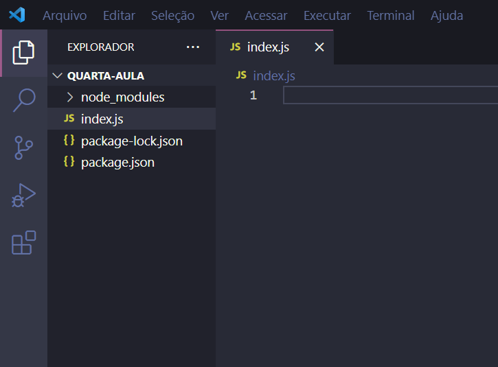
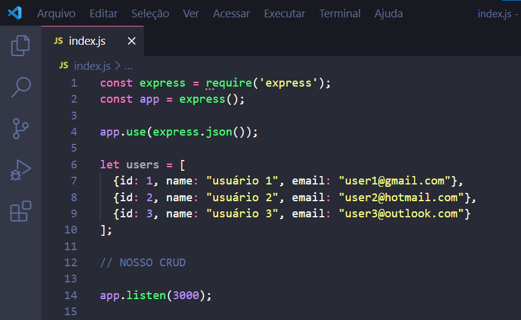

  🖼️IMG CRUD🖼️

<h1 align="center">Seu primeiro CRUD com NodeJS</h1>

Aqui você vai aprender a desenvolver seu primeiro CRUD com NodeJS

  
  
  

  🖼️IMG OU VIDEO MOSTRANDO PROJETO🖼️

<h2>🧠 O que você vai utilizar</h2>
<ul>
  <li>JavaScript</li>
  <li>JSON</li>
  <li>NodeJS</li>
  <li>Express</li>
</ul>

<h2>⚙️ O que você vai precisar</h2>
<ul>
  <li>IDE (recomendo o <a href="https://code.visualstudio.com/download">VSCode</a>)</li>
  <li><a href="https://nodejs.org/en/">NodeJS</a></li>
  <li>Insomnia ou Postman (utilizo <a href="https://insomnia.rest/download">Insomnia</a>)</li>
  <li><a href="https://www.npmjs.com/">NPM</a> ou <a href="https://yarnpkg.com/">Yarn</a></li>
</ul>

<h2 align="center">Resumo</h2>

Com o auxílio dessa documentação, você vai conseguir fazer um CRUD utilizando NodeJS. <b>Não utilizaremos dados complexos ou externos de banco de dados e também não contaremos com uma arquitetura e estrutura organizada e planejada</b>, tudo será feito em um pequeno arquivo "index.js". O principal objetivo aqui é você entender os conceitos de um CRUD na prática.

<h2 align="center">Qualquer dúvida você pode consultar aqui...</h2>
<h3>O que é API</h3>

API significa Application Programming Interface, ou, em português, Interface de Programação de Aplicativos. Ela faz ponte de um sistema para outro, no qual será possível que um sistema compartilhe suas ações, ferramentas e entre outros, ou seja, eles se conversam. Agora falando no nosso caso, o que é um API REST? API REST é uma API como explicado anteriormente, porém ela utiliza o protocolo HTTP na versão 1.1, ele aceita novos métodos de comunicação como PUT, POST e DELETE, sendo assim possível construir APIs mais poderosas.

<a href="https://www.instagram.com/p/CZvYe1ZNqSb/">Clique aqui e saiba mais de API</a>

 

<h3>O que é CRUD</h3>

CRUD (Create, Read, Update, Delete) é um acrônimo para as maneiras de se operar em informação armazenada. Básicamente são as quatro operações básicas para se trabalhar com dados.

<ul>
  <li>Create - Cria um dado.</li>
  <li>Read - Lista um dado.</li>
  <li>Update - Atualiza um dado.</li>
  <li>Delete - Deleta um dado.</li>
</ul>
 

<h3>O que é Middleware</h3>

Middleware é todo o tipo de função que está entre um pedido HTTP e a resposta final que o servidor envia de volta para o cliente. Ou seja, ao usar o "GET", para listar uma informação por exemplo, podemos ter um função antes de executar a resposta dada a esse verbo que foi pedido, tendo uma condiçãoa para seguir, caso de "false", a listagem não será retornada.

 

<h3>O que é JSON</h3>

JSON significa JavaScript Object Notation. Ele se resume em um formato de representação de dados que é leve para troca de informações entre sistemas. Ele utiliza o formato de chave e valor, sendo o mais utilizado para APIs e arquivos de configurações. Fique tranquilo, se você é familiarizado com objetos em JavaScript, JSON não vai ser um problema para você. Aceita diversos tipos de dados: 
<ul>
  <li>Strings</li>
  <li>Numbers</li>
  <li>Arrays</li>
  <li>Objetos</li>
  <li>Null</li>
  <li>Boolean</li>
</ul>

<a href="https://www.instagram.com/p/CcYucwrPQRK/">Clique aqui e saiba mais de JSON</a>

 

<h3>O que é e quais são os métodos HTTP</h3>

HTTP é um protocolo que define um conjunto de métodos de requisição responsáveis por indicar a ação a ser executada para um dado recurso. Para cada ação temos diferentes "verbos", quais indicam a ação que será tomada. Para realizar esse CRUD, vamos usar:

<ul>
  <li>
    GET - Esse verbo é um método qual solicita uma representação de recurso, ou seja, ela fará o "read" de nosso CRUD, pois vai retornar uma listagem ou apenas um recurso quando específicado junto com os <a href="">querys</a> da nossa <a href="">URI</a>.
  </li> 
  <li>
    POST - Será o verbo reponsável pelo "create" do nosso CRUD, ou seja, com ele será possível o envio de dados para ele.
  </li> 
  <li>
    PUT - Verbo que será utilizado para o "update" do CRUD. Com ele é possível enviar novos dados, assim atualizando o que desejamos com novas informações.
  </li>
  <li>
    DELETE - Como o próprio verbo já diz, esse método vai excluir o dado desejado, sendo assim ele o "delete" do nosso CRUD.
  </li> 
</ul>
 

<h3>Sobre NodeJS</h3>

NodeJS pode ser definido como um ambiente de execução Javascript server-side. Isso significa é possível criar aplicações Javascript, sem depender de um browser para a execução, como estamos acostumados. Ele será uma ferramenta essêncial para a criação da nossa API, sendo possível acessar ela com o Front-End e se integrada com um banco de dados, criar uma super aplicação!

<a href="https://www.instagram.com/p/CcYucwrPQRK/">Conheça myFit, meu super projeto</a>

 

<h3>Sobre Express</h3>

Express é o framework mais popular de Node, que facilita o desenvolvimento de nossas aplicações. É uma biblioteca necessária para uma série de outros frameworks do Node. Ele oferece diversas soluções minimalistas, mas para realizar nosso CRUD, as funções utilizadas nele será para requisições de diferentes verbos HTTP para diferentes URIs, utilização de middlewares, configuração para controle do servidor, como porta utilizada para conexão e o controle de rotas com URIs.

 

<h3>URL vs URI</h3>

Abaixo você encontra uma imagem explicativa, para você entender visualmente essa diferença de termos, mas qualquer um vai te entender usando qualquer um dos termos.

IMG URL VS URI

<a href="https://www.instagram.com/p/CcYucwrPQRK/">Curta esse post caso queira entender um pouco mais</a>

 

<h3>Sobre Nodemom</h3>

Nodemom é...

 

<h3>Sobre Insomnia</h3>

Insomnia é uma ferramenta cliente para API REST, utilizado para testes de API, ou seja, com ele vamos testar e ver nosso CRUD acontecendo. Vamos usar essa ferramenta para organizar e vizualizar nossos métodos HTTP.

 

<h3>Sobre NPM</h3>

NPM é...

 

<h1 align="center">🔥 Configurando o ambiente...</h1>
<h3>Configurando nosso cliente que vai consumir a API (aqui utilizei o <a href="https://insomnia.rest/download">Insomnia</a>)</h3>

Para isso, basta abrir o Insomnia e criar 4 métodos HTTP, sendo eles: GET, POST, UPDATE e DELETE. Para todos utilizaremos a seguinte rota: <b>http://localhost:3000/clientes</b>. Isso significa que, estamos configurando em um ambiente local (sua máquina/seu ip, por isso utilizamos <b>"localhost"</b>), na porta <b>3000</b> e na rota <b>"clientes"</b>.

<h3>Configurando NodeJS</h3>

Configurando...

 

 

<h1 align="center">🚀 Vamos para a prática!</h1>
<h3>Começando o projeto CRUD</h3>

Após a instalação e a configuração do que foi pedido acima, vamos iniciar a parte prática de vez!

Crie uma pasta e abra em seu VSCode. Logo após com o atalho "CTRL + J", você vai abrir seu terminal diretamente do VSCode e no caminho da pasta aberta no IDE. Em seguida basta digitar <code>npm init</code>, com isso iniciamos nosso pacote, criando o arquivo package.json -esse arquivo contém toda configuração utilizada para determinar e configurar dependências do seu projeto, tais como os pacotes qual sua aplicação dependerá e scripts de automatização-.

 

GIF FAZENDO NPM INIT

 

Agora crie uma pasta "index.js" e instale as dependencias necessárias. Como faremos um CRUD simples utilizaremos na construção do projeto apenas o <a href="">Express.js</a> e o <a href="">nodemon</a>, sendo este último não obrigatório, ele vai facilitar o nosso desenvolvimento com a automação do nosso ambiente.

 

GIF MOSTRANDO INSTALAÇÂO DAS DEPENDENCIAS

 

Com essas dependencias instaladas, o packed.json criado no inicio e o arquivo index.js criado, sua pasta deverá estar desse jeito

 

  

 

<h3>Base do nosso projeto</h3>

  

Para você entender melhor o que está acontecendo aqui, explicarei linha a linha o projeto por inteiro.

<code>const express = require('express')</code> -> Importa o framework que instalamos;

<code>const app = express()</code> -> Adiciona todos seus recursos na variável "app";

<code>app.use(express.json())</code> -> Indica para nossa variável app que contem os recursos do framework, usar o middleware "json()", qual vai facilitar a interpretação desses objetos;

<code>let users = []</code> -> Uma array de objetos que criamos para representar nosso banco de dados, nela que vamos realizar nosso CRUD. Lembrando que as modificações não são permanentes, ela reseta com a finalização de nosso servidor (ao fechar o programa);

<code>app.listen(3000)</code> -> Todo nosso códi terá que ficar antes dessa linha, indiquei com o comentário "CRUD" o local que todo nosso CRUD vai ocorrer, essa linha é responsável de dizer que nosso servidor utilizará a porta 3000, com isso nossa url para acessálo via browser ou pelo cliente REST será: <b>https://localhost:3000></b>;

 

<h3>👀 READ</h3>

Vamos iniciar nosso CRUD construindo o método que vai permitir que você vizualise os dados de sua API.

 
  
<h3>➕ CREATE</h3>

Vamos iniciar nosso CRUD construindo o método que vai permitir que você vizualise os dados de sua API.

 
  
<h3>✏️ UPDATE</h3>

Vamos iniciar nosso CRUD construindo o método que vai permitir que você vizualise os dados de sua API.

 
  
<h3>❌ DELETE</h3>

Vamos iniciar nosso CRUD construindo o método que vai permitir que você vizualise os dados de sua API.

 

<h2 align="center">❤️developed with love by Leonardo Alencar❤️</h2>

<b>FOLLOW ME!</b>

  
  
  
  
  

LA | Leonardo Alencar.

